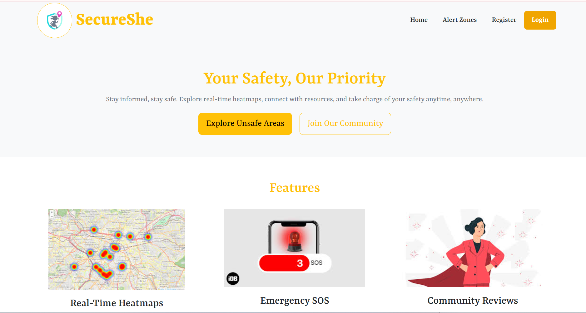
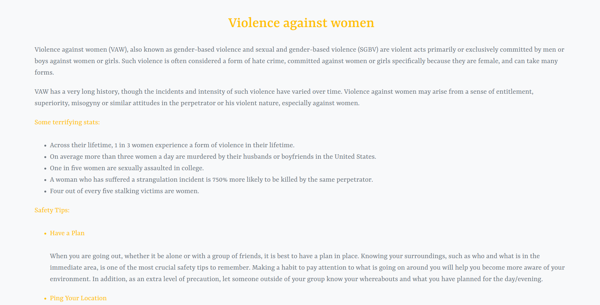
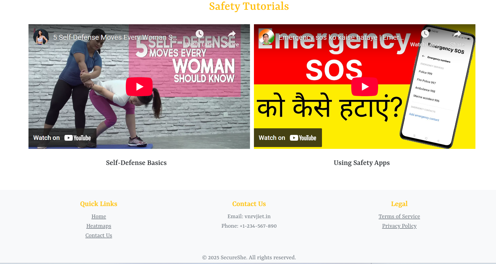
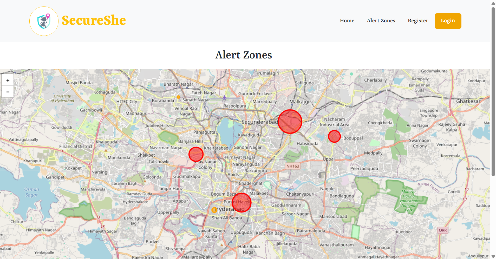
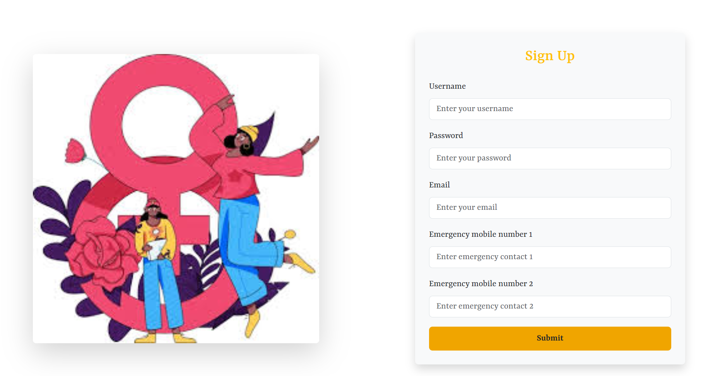
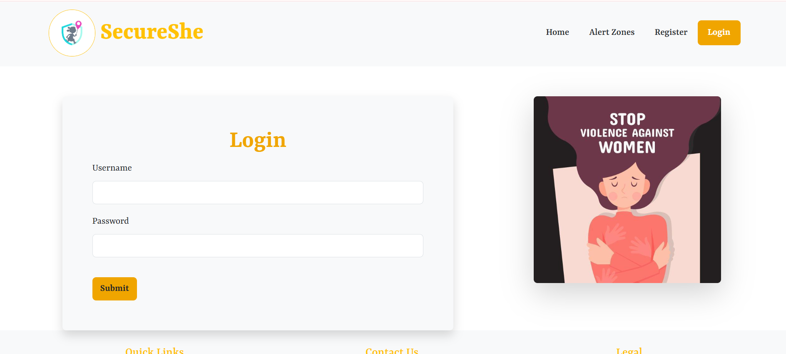

### Women-Safety-Website SecureShe

**SecureShe** is simple women safety website . It consists of heat maps locating unsafe areas marked by other women . It also has emergency sos buttons .
A simple local database is used to store user information . Only registered users can login to the website .  In their profile page they can also mark unsafe areas . This page also has emegency buttons . the are not connected with any messaging apis . just a simple bootstrap is used for sending the user a notification

**Technologies used**:
 react js , Html , CSS , Javascript , Bootstrap ,Leaflet
 jason server for backend

## Prerequisites

Before running the project, make sure you have the following installed:

- [Node.js](https://nodejs.org/) (Latest LTS version recommended)
- npm (Comes with Node.js)

### Install Required Dependencies

Run the following command inside your project directory:

```sh
npm install json-server leaflet react react-dom react-hook-form react-icons react-leaflet react-router-dom
npm run dev
```
### Screenshots

Here are some screenshots of the SecureShe website:

- **Home Page**  
  

- **Education About Violence**  
  

- **Safety Tutorials**  
  

- **Alert Zones**  
  

- **Register Page**  
  

- **Login Page**  
  


